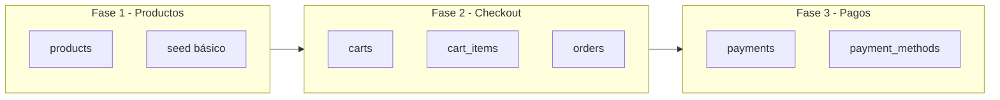

# Plan de Base de Datos: Sistema de Autopago

## Resumen

Este documento detalla el plan de desarrollo de la base de datos para el sistema de autopago, priorizando fases tempranas para pruebas iniciales con datos sencillos, con el objetivo final de soportar códigos de barras reales (EAN-13, UPC-A, EAN-8, UPC-E).

---

## Estado del desarrollo (actualizado)

| Fase | Entidades / Tareas | Estado |
|------|-------------------|--------|
| **Fase 1** | Tabla `products` + seed básico | ✅ Completado |
| | Backend `GET /api/products/barcode/:barcode` | ✅ Completado |
| | Frontend consume API (sin MOCK) | ✅ Completado |
| **Fase 2 (3.2)** | Tablas `carts`, `cart_items`, `orders` | ✅ Completado |
| | `document_id` en carts y orders | ✅ Completado |
| | Backend `POST /api/carts`, `POST /api/carts/:id/items`, etc. | ✅ Completado |
| | Frontend integra carrito/orden con API | ✅ Completado |
| **Fase 3** | Tablas `payment_methods`, `payments` | ✅ Completado |
| | Backend `GET /api/payment-methods`, `POST /api/payments` | ✅ Completado |
| | Frontend integra selección de método y pago con API | ✅ Completado |
| **Fase 4** | Inventario (stock, movimientos) | 🔲 Siguiente |
| **Fase 5** | Operadores, kiosks, auditoría | 🔲 Pendiente |

**Fase actual:** Fases 1–3 completadas (hasta 3.2 + pagos). Siguiente: Fase 4

---

## 1. Stack ✅

### 1.1 Base de datos ✅

- **PostgreSQL 15** — Base de datos principal (configurado en `docker-compose.yml`)
- **Redis** — Caché y sesiones (fase posterior)

### 1.2 Migraciones y seeds ✅

- **Fase 1–2:** SQL directo en `scripts/init-db.sql` (ejecutado al arrancar el contenedor)
- **Fase posterior:** Evaluar Prisma o TypeORM para migraciones versionadas

---

## 2. Fases priorizadas para pruebas iniciales ✅



---

## 3. Esquema por fase

### 3.1 Fase 1 — MVP de productos (prioridad máxima) ✅

**Objetivo:** Reemplazar MOCK_PRODUCTS en el frontend con datos reales desde PostgreSQL.

**Tabla `products`:**

| Columna | Tipo | Descripción |
|---------|------|-------------|
| id | UUID (PK) | Identificador único |
| barcode | VARCHAR(20) UNIQUE | Código de barras (EAN-13, UPC-A, etc.) |
| sku | VARCHAR(50) | SKU interno |
| name | VARCHAR(255) | Nombre del producto |
| price | DECIMAL(10,2) | Precio unitario |
| category | VARCHAR(100) NULL | Categoría |
| image_url | VARCHAR(500) NULL | URL de imagen |
| weight_based | BOOLEAN DEFAULT FALSE | ¿Producto por peso? |
| created_at | TIMESTAMPTZ | Fecha de creación |
| updated_at | TIMESTAMPTZ | Fecha de actualización |

**Índice:** `idx_products_barcode` en `barcode` para búsqueda rápida.

**Seed mínimo:** 4–6 productos con códigos 12345678, 87654321, 11111111, 22222222.

**Integración backend:** Endpoint `GET /api/products/barcode/:barcode`.

---

### 3.2 Fase 2 — Carritos y órdenes ✅

**Tabla `carts`:**

| Columna | Tipo | Descripción |
|---------|------|-------------|
| id | UUID (PK) | Identificador único |
| kiosk_id | VARCHAR(50) NULL | ID del kiosk (MVP: nullable) |
| status | VARCHAR(20) | active, pending_payment, completed, cancelled |
| created_at | TIMESTAMPTZ | Fecha de creación |
| updated_at | TIMESTAMPTZ | Fecha de actualización |

**Tabla `cart_items`:**

| Columna | Tipo | Descripción |
|---------|------|-------------|
| id | UUID (PK) | Identificador único |
| cart_id | UUID (FK) | Referencia al carrito |
| product_id | UUID (FK) | Referencia al producto |
| quantity | INTEGER | Cantidad |
| unit_price | DECIMAL(10,2) | Precio unitario en el momento |

**Tabla `orders`:**

| Columna | Tipo | Descripción |
|---------|------|-------------|
| id | UUID (PK) | Identificador único |
| cart_id | UUID (FK) | Referencia al carrito |
| subtotal | DECIMAL(10,2) | Subtotal |
| tax | DECIMAL(10,2) | IVA |
| total | DECIMAL(10,2) | Total |
| status | VARCHAR(20) | pending, completed, cancelled |
| created_at | TIMESTAMPTZ | Fecha de creación |

---

### 3.3 Fase 3 — Pagos y métodos ✅

**Tabla `payment_methods`:**

| Columna | Tipo | Descripción |
|---------|------|-------------|
| id | UUID (PK) | Identificador único |
| code | VARCHAR(20) UNIQUE | Código (TARJETA, EFECTIVO, PAGO_MOVIL) |
| name | VARCHAR(100) | Nombre para mostrar |

**Tabla `payments`:**

| Columna | Tipo | Descripción |
|---------|------|-------------|
| id | UUID (PK) | Identificador único |
| order_id | UUID (FK) | Referencia a la orden |
| method_id | UUID (FK) | Referencia al método de pago |
| amount | DECIMAL(10,2) | Monto |
| status | VARCHAR(20) | pending, completed, failed |
| reference | VARCHAR(100) NULL | Referencia externa (autorización, etc.) |
| created_at | TIMESTAMPTZ | Fecha de creación |

---

### 3.4 Fases posteriores (documentadas)

- **Fase 4:** Inventario — `stock`, `stock_movements`, productos con stock.
- **Fase 5:** Operadores, kiosks, auditoría — `operators`, `kiosks`, `audit_events`.

---

## 4. DDL — Fase 1 ✅

```sql
-- Tabla products
CREATE TABLE products (
  id UUID PRIMARY KEY DEFAULT uuid_generate_v4(),
  barcode VARCHAR(20) UNIQUE NOT NULL,
  sku VARCHAR(50) NOT NULL,
  name VARCHAR(255) NOT NULL,
  price DECIMAL(10,2) NOT NULL,
  category VARCHAR(100),
  image_url VARCHAR(500),
  weight_based BOOLEAN DEFAULT FALSE,
  created_at TIMESTAMPTZ DEFAULT NOW(),
  updated_at TIMESTAMPTZ DEFAULT NOW()
);
CREATE INDEX idx_products_barcode ON products(barcode);

-- Seed mínimo para pruebas
INSERT INTO products (barcode, sku, name, price) VALUES
  ('12345678', 'SKU001', 'Producto prueba 1', 2.50),
  ('87654321', 'SKU002', 'Producto prueba 2', 5.99),
  ('11111111', 'SKU003', 'Leche 1L', 1.20),
  ('22222222', 'SKU004', 'Pan integral', 0.85);
```

---

## 5. Integración con backend ✅

El backend (Express en `apps/backend/src/main.ts`) debe:

1. Conectarse a PostgreSQL usando `pg` o Prisma.
2. Exponer `GET /api/products/barcode/:barcode` que consulte la tabla `products`.
3. Devolver 404 si el producto no existe.

**Ejemplo de respuesta:**

```json
{
  "id": "uuid",
  "barcode": "12345678",
  "sku": "SKU001",
  "name": "Producto prueba 1",
  "price": 2.50,
  "category": null,
  "imageUrl": null,
  "weightBased": false
}
```

---

## 6. Consideraciones para códigos de barras reales

### 6.1 Formatos soportados

Según [requirements.md](requirements.md), el sistema debe soportar:

- **UPC-A** (12 dígitos)
- **UPC-E** (8 dígitos)
- **EAN-13** (13 dígitos)
- **EAN-8** (8 dígitos)

`VARCHAR(20)` cubre todos estos formatos.

### 6.2 Normalización

- Guardar códigos sin espacios ni guiones.
- Validación/transformación en el backend antes de consultar.

### 6.3 Evolución de datos

- **Inicio:** Seed con códigos cortos (8 dígitos) para pruebas.
- **Producción:** Import masivo o integración con catálogo externo con códigos reales.

---

## 6.4 Uso del archivo Open Food Facts (openfoodfacts_export.csv)

**Ubicación:** `scripts/seed/openfoodfacts_export.csv`

Este archivo es un export de [Open Food Facts](https://world.openfoodfacts.org/) con productos reales y códigos de barras EAN-13, útil para probar el escáner y la búsqueda por barcode en entorno de desarrollo.

### Mapeo de columnas a la tabla `products`

| Columna CSV | Columna BD | Notas |
|-------------|------------|-------|
| `code` | `barcode` | Código EAN-13 del producto |
| `product_name_es` o `product_name_en` o `product_name_fr` | `name` | Priorizar español si existe |
| `brands` | — | Opcional: concatenar con `name` |
| `categories` | `category` | Primera categoría o resumir |
| — | `sku` | Generar (ej. `SKU-{code}`) |
| — | `price` | **No incluido en OFF.** Definir manualmente o con script |
| `image_url` | `image_url` | OFF no incluye URL en este export; buscar en API si se necesita |

### Limitación importante

Open Food Facts no incluye precios. Para cargar el CSV en `products` hay que:

1. **Opción A:** Asignar un precio por defecto (ej. 1.00) durante el import.
2. **Opción B:** Mantener una tabla auxiliar de precios por barcode y actualizar después.
3. **Opción C:** Script que pida precios para los primeros N productos y use un valor por defecto para el resto.

### Cómo importar el CSV

1. Crear un script en `scripts/` (por ejemplo `scripts/import-openfoodfacts.ts` o `.sh`) que:
   - Lea el CSV (usar `csv-parser`, `papaparse` o `COPY` de PostgreSQL).
   - Mapee las columnas según la tabla anterior.
   - Inserte en `products` con `ON CONFLICT (barcode) DO NOTHING` o `DO UPDATE`.
2. Ejecutar tras levantar PostgreSQL:
   ```bash
   # Ejemplo (cuando exista el script):
   cd scripts && node import-openfoodfacts.js
   ```

### Actualizar el export

Para obtener un CSV más reciente desde Open Food Facts:

1. Ir a https://world.openfoodfacts.org/data
2. Descargar un export (formato TSV/CSV con campos seleccionados)
3. Sustituir `scripts/seed/openfoodfacts_export.csv` por el nuevo archivo
4. Re-ejecutar el script de import

---

## 7. Comandos útiles

```bash
# Levantar PostgreSQL
docker compose up -d postgres

# init-db.sql se ejecuta automáticamente en el primer arranque del contenedor.
# Si la base ya existía antes de añadir la tabla products:
#   Opción A: docker compose down -v && docker compose up -d postgres (pierde datos)
#   Opción B: Conectar y ejecutar el DDL de la sección 4 manualmente

# Conectar a PostgreSQL
docker exec -it autopago-db psql -U postgres -d autopago

# Ver productos
SELECT * FROM products;
```

---

_Documento creado el 22 de marzo de 2026_
